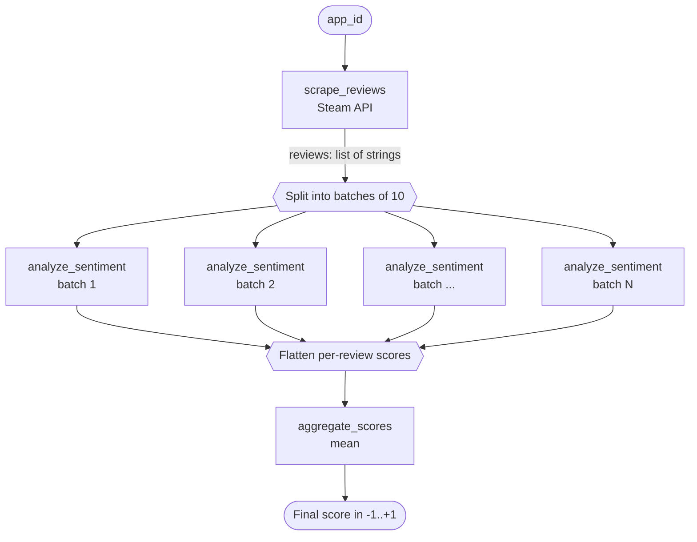

# Product Sentiment Analysis

A Temporal-based Python pipeline that pulls product reviews from Steam, runs sentiment analysis on each review with a HuggingFace model, and returns an averaged score for the product.

## Prerequisites

- **Python 3.13**
- **Temporal CLI** — for running a local Temporal server (`temporal server start-dev`)
  - macOS: `brew install temporal`
  - Other: see https://temporal.io/setup/install-temporal-cli

## Setup

```bash
python3.13 -m venv .venv
source .venv/bin/activate
pip install -r requirements.txt
```

The first workflow run downloads a ~256 MB sentiment model from HuggingFace into `~/.cache/huggingface/`. Subsequent runs use the cache.

## Running

You need three terminals.

**Terminal 1 — start the Temporal server (local dev mode):**

```bash
temporal server start-dev
```

This starts a Temporal server on `localhost:7233` and a Web UI on http://localhost:8233.

**Terminal 2 — start the worker:**

```bash
source .venv/bin/activate
python worker.py
```

The worker hosts the workflow and activities. Leave it running.

**Terminal 3 — trigger a workflow execution:**

```bash
source .venv/bin/activate
python run_workflow.py
```

It will print the final sentiment score for the configured Steam app id.

## Configuration

Edit `run_workflow.py` to change the Steam app id. The id is the number in the Steam store URL — for example:

- `620` — Portal 2
- `570` — Dota 2
- `730` — Counter-Strike 2
- `728880` — Overcooked 2

## How it works



The workflow runs three activities:

1. **`scrape_reviews(app_id)`** — calls Steam's public reviews endpoint and returns up to 100 recent English review texts.
2. **`analyze_sentiment(texts)`** — runs each review through `distilbert-base-uncased-finetuned-sst-2-english`, returning a signed confidence score per review (positive = POSITIVE label, negative = NEGATIVE label, magnitude = model confidence). The workflow fans out 10 parallel `analyze_sentiment` activities (one per batch of 10 reviews).
3. **`aggregate_scores(scores)`** — returns the mean of the per-review scores.

Result is in `[-1, +1]`: positive values mean mostly-positive reviews, negative values mean mostly-negative.
